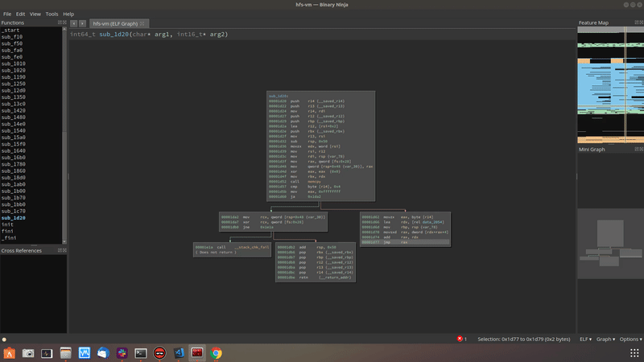

# Indirect branches setter
Author: **jofra (@V_jofra)**

_A binary ninja plugin that eases fixing jump table branches_

# Description
This plugin allows you to easily edit the branches of an indirect jump. This is helpful in situations where binja fails to identify jump tables. To fix this, previously you would have to use the python console, but with this plugin you can do it from a simple UI.

You can insert the target addresses as a single addr (hex or decimal) (e.g. `0x2000` or `123`) or a comma separated list (e.g. `0x1d80, 0x1dc0, 0x1de0, 0x1df0, 0x1e00`) as shown in the gif.

# Install
To install this plugin, navigate to your Binary Ninja plugins directory, and run `git clone git@github.com:Vasco-jofra/indirect-branch-setter.git`.

# License
This plugin is released under a MIT license.